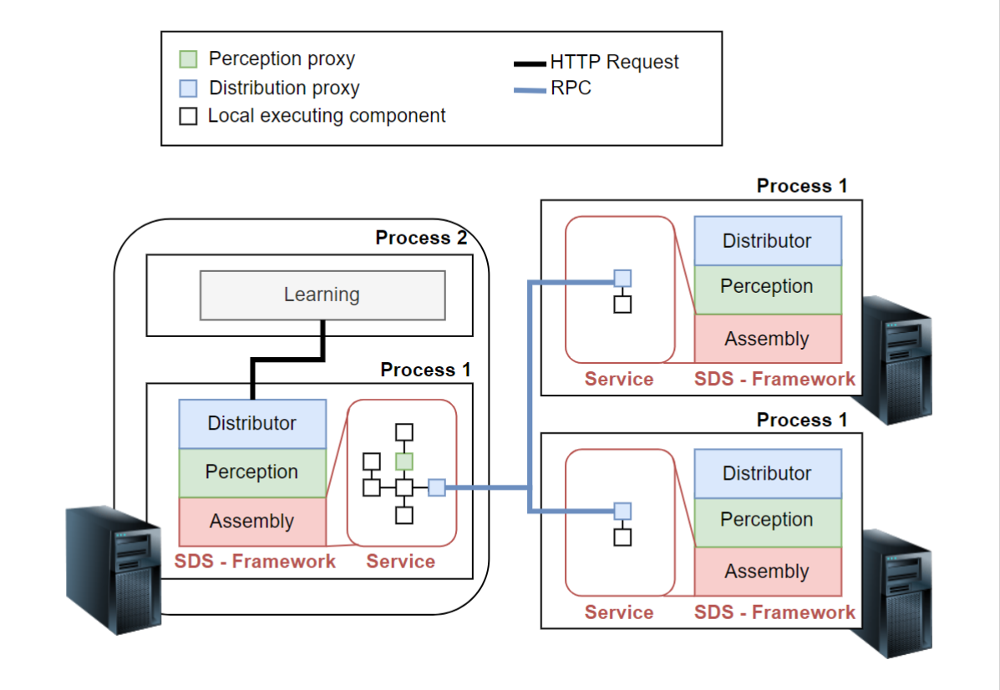
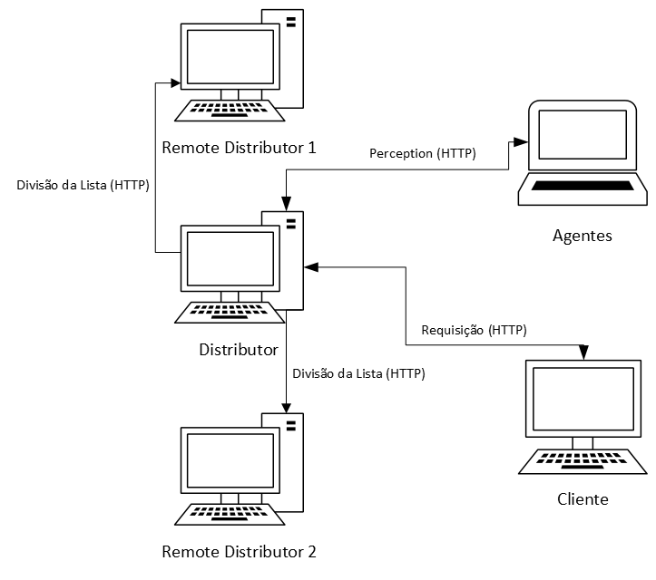

# Self Adaptive Systems: Multiagent Approach

## Introdução
O design e a gestão de sistemas distribuídos têm sido o foco de pesquisa nas comunidades de sistemas por muitos anos. Decidir, no momento do design, como os diferentes módulos que compõem os sistemas devem interagir para manter sistemas de alto desempenho, confiáveis e consistentes é um desafio. Esse cenário se agrava cada vez mais quando consideramos os altos níveis de volatilidade que encontramos em sistemas distribuídos de grande escala, exigindo novas ideias para lidar com os novos níveis de complexidade.

O conceito de Sistemas Auto-distribuídos (SDS) surgiu para enfrentar os desafios de transferir a responsabilidade de montar sistemas distribuídos para o próprio sistema em tempo de execução, ao contrário do que é feito atualmente na indústria, onde um grupo de engenheiros é responsável por considerar como o sistema deve operar em muitas condições distintas e muitas vezes inesperadas durante a fase de design. Em tempo de execução, os engenheiros monitoram o sistema para detectar mudanças e adaptá-lo manualmente de acordo com as necessidades.

Neste projeto, será desenvolvida uma abordagem multiagente para o aprendizado de composições distribuídas para SDS em tempo de execução, com o objetivo de comparar o desempenho e abordar as limitações dos algoritmos de multi-armed bandits ao lidar com problemas de aprendizado em SDS.

## Descrição da Proposta

A proposta é investigar a aplicação de sistemas multiagentes no contexto de sistemas distribuídos auto-adaptativos, com foco na formulação do problema como um Multi-Armed Bandit Multijogador (MMAB). Nessa abordagem, vários agentes colaboram para determinar a configuração ótima do sistema em resposta às solicitações dos clientes, adaptando o sistema em tempo real conforme as condições variam.

A solução proposta é baseada em software e utiliza uma abordagem multiagente para a configuração dinâmica de sistemas distribuídos. O sistema será modelado como um ambiente com múltiplos "braços" (possíveis configurações), onde cada agente representará uma estratégia de configuração específica. O sistema de agentes monitorará o desempenho do sistema em termos de tempo de resposta e adaptará a configuração do sistema em tempo de execução para otimizar o desempenho. Além disso, a solução será desenvolvida em um ambiente de simulação e testes que envolverá um cluster de três nós conectados em uma rede.

## Principais funcionalidades

As principais funcionalidades incluem:

- **Agentes Multiagentes:** Cada agente tomará decisões de configuração de forma independente, mas colaborativa, utilizando o feedback de desempenho do sistema.
- **Adaptação Dinâmica:** O sistema ajustará sua configuração com base em métricas de desempenho coletadas em tempo real, como o tempo de resposta ao lidar com requisições de clientes.
- **Simulação e Testes:** O ambiente de simulação permitirá a criação de diferentes cenários de cargas de trabalho e condições do sistema para testar a eficácia da abordagem proposta.

## Abordagem Utilizada para Implementação

A implementação utilizará uma combinação de ferramentas e plataformas de simulação e desenvolvimento distribuído. A metodologia adotada será a modelagem de sistemas distribuídos como ambientes multiagentes, com a utilização do framework JaCaMo para o desenvolvimento. Para testes e avaliação, será utilizada uma plataforma de simulação em um cluster de nós locais, permitindo a experimentação com diferentes configurações e cargas de trabalho. Além disso, a implementação seguirá uma abordagem iterativa, onde os agentes usarão estratégias de exploração e exploração para aprender qual configuração do sistema resulta no melhor desempenho ao longo do tempo.

## Diagrama de Comunicação
O sistema será composto de quatro elementos principais: o servidor web (*distributor*), o sistema de agentes, dois distribuidores remotos (*remote distributor*) e um cliente que fará as requisições ao servidor. 

A ideia principal por trás do conceito de Sistemas Auto-distribuídos (SDS) é transferir mais responsabilidade pelo design distribuído de sistemas de software para o próprio sistema. Os desenvolvedores de SDS precisam apenas projetar e desenvolver o software local (ou seja, software que roda em um único processo), deixando as decisões de design distribuído para serem realizadas pelo próprio sistema em tempo de execução, com base na observação do ambiente operacional atual.

Dada uma métrica específica, por exemplo, o tempo de resposta coletado do sistema em execução, o SDS experimenta realocar e replicar seus componentes constituintes para aprender qual composição distribuída gera a maior recompensa. Para concretizar esse conceito, o SDS é desenvolvido usando um modelo baseado em componentes que permite que os sistemas de software sejam desenvolvidos a partir de componentes de software reutilizáveis e pequenos.

Esses modelos baseados em componentes permitem mudanças na arquitetura em tempo de execução sem tempo de inatividade, ou seja, enquanto o software continua a lidar com solicitações de entrada. Esse mecanismo de adaptação permite que o SDS substitua qualquer um de seus componentes constituintes por componentes proxy, Chamadas de Procedimento Remoto (RPCs) para redirecionar chamadas de função locais para os componentes realocados em outras máquinas.

A figura mostra um SDS executando em um cluster de 3 nós. No nível de infraestrutura, temos três máquinas conectadas à mesma rede local. No nível do sistema operacional, consideramos que todas as máquinas estão executando o $Process 1$, que possui um tempo de execução de modelo baseado em componentes que executa um software local originalmente projetado (rotulado como 'Service') e o framework SDS, composto pelos módulos Assembly, Perception e Distributor.

O módulo Assembly é responsável por carregar, conectar os componentes e executá-los; o módulo Perception é responsável por inserir tipos especiais de componentes (denominados Perception proxy) que são responsáveis por coletar métricas de desempenho do sistema e de seu ambiente operacional; e, finalmente, o módulo Distributor é responsável por injetar o Distribution proxy no sistema local em execução, realocando e criando réplicas do componente original para serem executadas em máquinas externas.

O SDS também possui o módulo Learning que executa em um processo diferente e é responsável por aprender qual composição do sistema tem o melhor desempenho. O módulo Learning interage com o Distributor por meio de uma API HTTP, através da qual o módulo Learning é capaz de: *i)* obter uma lista das possíveis composições do sistema, *ii)* consultar periodicamente o desempenho do sistema, e *iii)* atribuir uma composição específica ao sistema.

Nos experimentos, todas as interações e comunicações entre o sistema são efetuadas com o protocolo HTTP. O cliente faz a requisição das listas para o Distributor; Os agentes fazem a requisição do *Perception* ao Distributor, que devolve o tempo de resposta médio das últimas requisições; e o Distributor distribui a lista entre os dois Remote Distributor.

## Outras seções
- <a href="/execute.md">Como executar o projeto</a>
- <a href="/src/agents.md">Como funcionam os agentes</a>
- <a href="/self_distributing_system/proxies.md">Como funcionam os proxies</a>