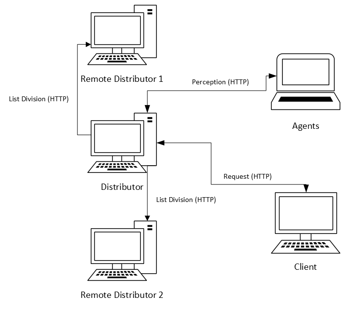

# A Multi-agent Approach to Self-Distributing Systems

## Introduction
The design and management of distributed systems have been a focus of research in systems communities for many years. Deciding, during the design phase, how the different modules comprising these systems should interact to maintain high performance, reliability, and consistency is a challenge. This scenario becomes increasingly complex when considering the high levels of volatility found in large-scale distributed systems, requiring new ideas to handle these new levels of complexity.

The concept of Self-Distributing Systems (SDS) emerged to address the challenge of shifting the responsibility for assembling distributed systems to the system itself at runtime. This contrasts with the current approach in the industry, where a group of engineers determines how the system should operate under many distinct and often unexpected conditions during the design phase. At runtime, engineers monitor the system to detect changes and manually adapt it as needed.

This project aims to develop a multiagent approach for learning distributed compositions for SDS at runtime, with the goal of comparing performance and addressing the limitations of multi-armed bandit algorithms when dealing with learning problems in SDS.

## Proposal Description

The proposed solution is software-based and uses a multiagent approach for the dynamic configuration of distributed systems. The system will be modeled as an environment with multiple "arms" (possible configurations), where each agent represents a specific configuration strategy. The agent system will monitor the system's performance in terms of response time and adapt the system configuration at runtime to optimize performance. Additionally, the solution will be developed in a simulation and testing environment involving a cluster of three nodes connected over a network.

## Key Features

The key features include:

- **Multiagent Agents:** Each agent will make configuration decisions independently but collaboratively, using system performance feedback.
- **Dynamic Adaptation:** The system will adjust its configuration based on real-time performance metrics, such as response time when handling client requests.
- **Simulation and Testing:** The simulation environment will enable the creation of different workload scenarios and system conditions to test the effectiveness of the proposed approach.

## Implementation Approach

The implementation will use a combination of tools and platforms for simulation and distributed development. The adopted methodology will involve modeling distributed systems as multiagent environments using the JaCaMo framework for development. For testing and evaluation, a simulation platform with a local node cluster will be used, allowing experimentation with different configurations and workloads. Additionally, the implementation will follow an iterative approach, where agents will use *exploitation* and *exploration* strategies to learn which system configuration delivers the best performance over time.

## Communication Diagram

In the experiments, all interactions and communications within the system are conducted using the HTTP protocol. The client requests the lists from the Distributor; the agents request *Perception* from the Distributor, which returns the average response time of recent requests; and the Distributor distributes the list between the two Remote Distributors.

## More Details
- <a href="/execute.md">How to run the project</a>
- <a href="/src/agents.md">How the agents work</a>
- <a href="/self_distributing_system/modules.md">How the proxies work</a>
