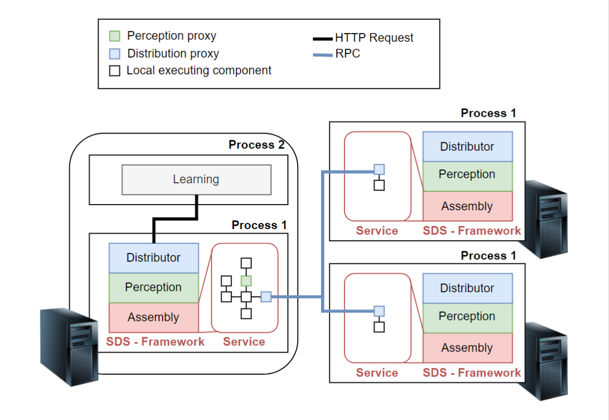

# Components Overview

The system consists of four main components: the web server (*distributor*), the agent system, two remote distributors, and a client that will make requests to the server.

The main idea behind the concept of Self-Distributing Systems (SDS) is to delegate more responsibility for the distributed design of software systems to the system itself. SDS developers only need to design and develop local software (i.e., software running in a single process), leaving distributed design decisions to be made by the system at runtime based on its observation of the current operational environment.

### Functionality and Approach

Given a specific metric, such as the response time collected from the running system, the SDS experiments with reallocating and replicating its constituent components to learn which distributed composition yields the highest reward. To realize this concept, the SDS is built using a component-based model that allows software systems to be developed from small, reusable software components.

These component-based models enable runtime architectural changes without downtime, meaning the software continues to handle incoming requests while adaptations occur. This adaptation mechanism allows the SDS to replace any of its constituent components with proxy components. These proxies use Remote Procedure Calls (RPCs) to redirect local function calls to components reallocated to other machines.

The figure illustrates an SDS running on a cluster of three nodes.  

- **Infrastructure Level**: Three machines connected to the same local network.  
- **Operating System Level**: All machines are running $Process 1$, which includes a component-based runtime executing locally designed software (labeled as 'Service') and the SDS framework. This framework is composed of the **Assembly**, **Perception**, and **Distributor** modules.

### Module Descriptions

1. **Assembly Module**:  
   - Responsible for loading, connecting, and executing components.  

2. **Perception Module**:  
   - Introduces special types of components (called Perception proxies) tasked with collecting performance metrics from the system and its operational environment.

3. **Distributor Module**:  
   - Injects the Distribution proxy into the local system, reallocating and replicating original components to execute on external machines.

4. **Learning Module**:  
   - Runs in a separate process and determines which system composition performs best.  
   - Communicates with the Distributor module via an HTTP API, enabling it to:  
     - *i)* Retrieve a list of possible system compositions.  
     - *ii)* Periodically query the system's performance.  
     - *iii)* Assign a specific composition to the system.  

This modular approach ensures a dynamic, adaptive system capable of optimizing its performance based on real-time observations of its environment.